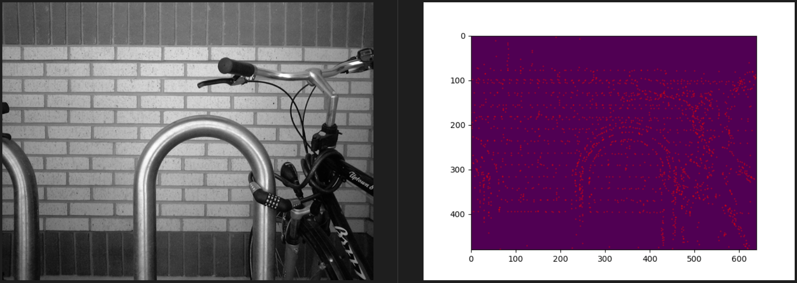

# Evolutionary Computing, Sobel + ACO image edge detection

Author: Kim Lehtinen, student at University of Vaasa

This software is partially based on the processes described in article written by Tian, J. , Y. Weiyu & X. Shengli (2008) "An ant colony optimization algorithm for image edge detection" which can be found here https://ieeexplore.ieee.org/document/4630880?arnumber=4630880 or for univaasa students/teachers https://ieeexplore-ieee-org.proxy.uwasa.fi/document/4630880. In the ACO part of this software, same processes are used as described in Tian et al (2008) paper: initialization process, construction process, update process and decision process. In addition, the idea of neighborhood also origins from Tian et al (2008) paper.

This software is implemented by Kim Lehtinen, but the concepts and ideas mentioned earlier belongs to Tian et al (2008).

## Install dependencies
```
pip install -r requirements.txt
```

## Run
```
python3 sobel-aco.py
```

## Result
